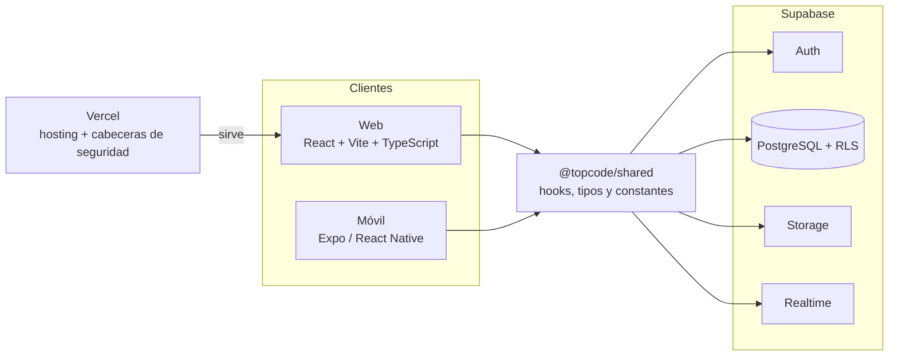
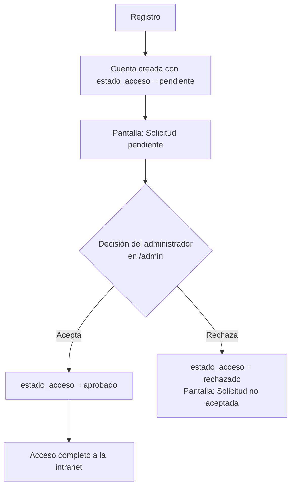

<div align="center">


# TopCode

### La intranet académica para estudiantes de DAM, DAW y ASIR

Actividades, calendario, apuntes, documentación en Markdown, foro de dudas, recursos y chat en tiempo real.
Todo en un solo sitio, con acceso aprobado por administradores y permisos por clase.

<br />

[](https://topcode-chi.vercel.app)
[](LICENSE)


<br />

**[Demo](https://topcode-chi.vercel.app)** · **[Características](#-características)** · **[Arquitectura](#-arquitectura)** · **[Seguridad](#-seguridad)** · **[Instalación](#-puesta-en-marcha-local)** · **[Despliegue](#-despliegue-en-vercel)**

</div>

<!-- Añade capturas en docs/screenshots y enlázalas aquí -->

---

## Índice

- [Características](#-características)
- [Arquitectura](#-arquitectura)
- [Seguridad](#-seguridad)
- [Stack tecnológico](#-stack-tecnológico)
- [Estructura del monorepo](#-estructura-del-monorepo)
- [Puesta en marcha local](#-puesta-en-marcha-local)
- [Variables de entorno](#-variables-de-entorno)
- [Configuración de Supabase](#-configuración-de-supabase)
- [Scripts](#-scripts)
- [Despliegue en Vercel](#-despliegue-en-vercel)
- [Contribuir](#-contribuir)
- [Licencia](#-licencia)

---

## ✨ Características

### 💬 Comunidad

| | Función | Ruta | Descripción |
|---|---------|------|-------------|
| 💬 | **Chat** | `/chat` | Chat en tiempo real y mensajes privados, con avisos y notificaciones del navegador |
| ❓ | **Foro de dudas** | `/foro`, `/foro/:id` | Publicaciones de dudas y fallos con respuestas y estado "resuelto" |
| 👤 | **Perfiles** | `/profile`, `/profile/:id` | Perfil propio y de otros usuarios |

### 🗓️ Organización

| | Función | Ruta | Descripción |
|---|---------|------|-------------|
| 🏠 | **Inicio** | `/` | Panel principal con acceso al horario semanal de la clase |
| ✅ | **Actividades** | `/actividades` | Seguimiento con filtros: todas, pendientes y completadas |
| 📅 | **Calendario** | `/calendar` | Eventos académicos |

### 📚 Contenido

| | Función | Ruta | Descripción |
|---|---------|------|-------------|
| 📖 | **Docs** | `/docs`, `/docs/:coleccionId/:paginaId` | Biblioteca tipo wiki en Markdown, con colecciones, páginas, importación de ficheros e historial de revisiones |
| 📝 | **Apuntes** | `/apuntes` | Apuntes compartidos entre alumnos (archivos en Supabase Storage) |
| 🔗 | **Recursos** | `/recursos` | Enlaces, documentos, vídeos, repositorios y herramientas |
| 🧭 | **Explorar** | `/explorar` | Vista general: dudas sin resolver, recursos y documentación recientes |

### 🛡️ Administración

| | Función | Descripción |
|---|---------|-------------|
| 🛂 | **Panel de admin** (`/admin`) | Solo administradores: aceptar o rechazar solicitudes de acceso y gestionar usuarios |
| 🕒 | **Gestión del horario** | Componente `AdminHorario` para el horario semanal por clase |
| 📢 | **Anuncios** | Modal de anuncios para todos los usuarios; solo el superadministrador puede crearlos (política RLS en `migracion_permisos_por_clase.sql`) |
| 🏫 | **Permisos por clase** | La gestión de apuntes, eventos y horario se limita a la clase del administrador |

### 📱 App móvil (`packages/mobile`)

Cliente Expo / React Native con inicio de sesión y cuatro pestañas: **Inicio**, **Chat**, **Notas** y **Tareas**.

> Las notas solo existen en la app móvil; la web no tiene ruta de notas.

---

## 🏗️ Arquitectura

Web y móvil comparten el paquete `@topcode/shared` (hooks, tipos y constantes) y hablan directamente con Supabase. La web se sirve desde Vercel.



### Flujo de acceso

Las cuentas nuevas no ven datos hasta que un administrador las aprueba (`estado_acceso`: `pendiente`, `aprobado` o `rechazado`).



---

## 🔒 Seguridad

Medidas verificadas en el SQL y la configuración del repositorio:

| Medida | Detalle | Dónde |
|--------|---------|-------|
| **Row Level Security** | Activada en las tablas del esquema (`usuarios`, `notas`, `mensajes`, `mensajes_privados`, `apuntes`, `eventos`, `actividades`, `actividades_estado`, `anuncios`, `horario`, docs, foro y recursos) | `setup.sql` y migraciones |
| **Política restrictiva `acceso_aprobado`** | Política `AS RESTRICTIVE` que exige `tc_usuario_acceso_aprobado()`: un usuario pendiente o rechazado no lee ni escribe en las tablas protegidas | `migracion_permisos_por_clase.sql`, `migracion_documentacion.sql` |
| **Permisos por clase** | Un administrador solo gestiona contenido y usuarios de su propia clase; los anuncios son solo del superadministrador | `migracion_permisos_por_clase.sql` |
| **Permisos mínimos** | `anon` no puede escribir en `usuarios` y nadie puede borrar perfiles desde el cliente; `email` y `es_superadmin` solo se leen mediante RPC | `migracion_seguridad.sql`, `setup.sql` |
| **Trigger `tc_proteger_usuarios`** | Impide cambiar `id`, `email`, `es_superadmin`, `promedio` y `clase`; nadie puede cambiar su propio `rol` o `estado_acceso`; un admin de clase solo puede tocar `rol` y `estado_acceso` de otros | `migracion_seguridad.sql` |
| **Funciones con `REVOKE ALL ... FROM PUBLIC`** | Las funciones auxiliares `tc_usuario_*` solo se ejecutan para `authenticated` | `migracion_permisos_por_clase.sql` |
| **Autoría fijada en servidor** | Triggers que asignan la autoría de colecciones y páginas de docs y guardan revisiones automáticamente | `migracion_documentacion.sql` |
| **Cabeceras y CSP en Vercel** | `Content-Security-Policy` (`default-src 'self'`, `connect-src` solo a `*.supabase.co`, `object-src 'none'`, `frame-ancestors 'none'`), `Strict-Transport-Security`, `X-Frame-Options: DENY`, `X-Content-Type-Options: nosniff`, `Referrer-Policy` y `Permissions-Policy` | `vercel.json` |

---

## 🧰 Stack tecnológico

| Capa | Tecnología | Versión (según `package.json`) |
|------|-----------|--------------------------------|
| Frontend web | React, React DOM | ^18.3.1 |
| | TypeScript | ^5.7.3 |
| | Vite | ^6.0.11 |
| | React Router | ^6.28.0 |
| Estilos | Tailwind CSS | ^3.4.17 |
| Markdown | react-markdown, remark-gfm, rehype-highlight | ^9.1.0, ^4.0.1, ^7.0.2 |
| Iconos | lucide-react | ^0.468.0 |
| Móvil | Expo, React Native, Expo Router | ~53.0.0, 0.76.9, ~4.0.20 |
| Backend | Supabase (PostgreSQL, Auth, Realtime, Storage) con `@supabase/supabase-js` | ^2.47.10 |
| Calidad | ESLint, Prettier | ^9.39.4, ^3.8.1 |
| Hosting | Vercel | — |

---

## 📁 Estructura del monorepo

Monorepo gestionado con npm workspaces (`packages/*`).

```
.
├── packages/
│   ├── web/       # Aplicación web (React + Vite + TypeScript)
│   ├── mobile/    # Aplicación móvil (Expo / React Native)
│   └── shared/    # Código compartido (lib, hooks, constantes)
├── supabase/      # Esquema y migraciones SQL
├── .github/       # Plantillas de issues
├── .env.example   # Plantilla de variables de entorno
└── vercel.json    # Configuración de despliegue
```

---

## 🚀 Puesta en marcha local

**Requisitos previos**

- Node.js y npm (el repositorio no fija una versión de Node concreta; usa una versión LTS reciente).
- Un proyecto de [Supabase](https://supabase.com).
- Para la app móvil: Expo (se lanza con `npm run mobile`).

```bash
# 1. Clona el repositorio
git clone https://github.com/Haise232/TopCode.git
cd TopCode

# 2. Instala las dependencias de todos los paquetes
npm install

# 3. Crea tu archivo de entorno
cp .env.example .env.local
# Edita .env.local con los datos de tu proyecto de Supabase

# 4. Arranca el servidor de desarrollo web
npm run dev
```

Vite sirve la web en `http://localhost:5173` por defecto. El archivo `.env.local` se lee desde la **raíz del repositorio** (así lo configura `packages/web/vite.config.ts`).

> Vercel instala con `npm install --legacy-peer-deps` (ver `vercel.json`). Si `npm install` te da conflictos de dependencias, prueba con esa misma opción.

---

## 🔑 Variables de entorno

<details>
<summary><b>Web</b> (en <code>.env.local</code>, ver <code>.env.example</code>)</summary>

<br />

| Variable | Descripción |
|----------|-------------|
| `VITE_SUPABASE_URL` | URL de tu proyecto de Supabase |
| `VITE_SUPABASE_ANON_KEY` | Clave pública (`anon`) de Supabase |

Ambas se obtienen en **Supabase Dashboard → Settings → API**.

</details>

<details>
<summary><b>App móvil</b> (<code>packages/mobile/src/lib/supabase.ts</code>)</summary>

<br />

Lee `Constants.expoConfig.extra.supabaseUrl` y `supabaseAnonKey`, o bien, como alternativa, estas variables:

| Variable | Descripción |
|----------|-------------|
| `EXPO_PUBLIC_SUPABASE_URL` | URL de tu proyecto de Supabase |
| `EXPO_PUBLIC_SUPABASE_ANON_KEY` | Clave pública (`anon`) de Supabase |

</details>

> No subas nunca `.env.local` al repositorio (está en `.gitignore`).

---

## 🗄️ Configuración de Supabase

Los scripts SQL están en `supabase/` y se ejecutan en **Supabase → SQL Editor**. Todos son idempotentes (según indican sus cabeceras).

<details>
<summary><b>Orden de ejecución</b></summary>

<br />

1. `supabase/setup.sql`: esquema base (tablas, RLS, índices, buckets de Storage y Realtime).
2. Migraciones, en este orden:
   1. `supabase/migracion_clase.sql`: columna `clase` en `usuarios` (12 grupos de DAM/DAW/ASIR).
   2. `supabase/migracion_permisos_por_clase.sql`: gestión limitada a la clase del administrador (se ejecuta después de `setup.sql`).
   3. `supabase/migracion_horario.sql`: tabla `horario` (horario semanal por clase).
   4. `supabase/migracion_documentacion.sql`: biblioteca de documentación en Markdown (requiere las funciones `tc_usuario_*` de la migración de permisos; elimina la antigua sección de Noticias).
   5. `supabase/migracion_foro_recursos.sql`: tablas del foro de dudas (`foro_posts`, `foro_respuestas`) y de recursos compartidos.
   6. `supabase/migracion_seguridad.sql`: protege las columnas sensibles de `usuarios` (rol, superadmin, promedio, clase) y ajusta las políticas de Storage.

</details>

Para promover al primer administrador, una vez registrado el usuario:

```sql
UPDATE public.usuarios SET rol = 'admin' WHERE email = 'tu@email.com';
```

Después, en **Authentication → URL Configuration** configura la *Site URL* y las *Redirect URLs* con la URL de tu despliegue.

---

## 📜 Scripts

Desde la raíz del repositorio:

| Comando | Descripción |
|---------|-------------|
| `npm run dev` | Servidor de desarrollo de la web |
| `npm run build` | Build de producción de la web (`tsc && vite build`) |
| `npm run preview` | Previsualiza el build de producción |
| `npm run lint` | Ejecuta ESLint sobre `packages/web/src` |
| `npm run mobile` | Inicia la app móvil con Expo |

<details>
<summary><b>Scripts adicionales por paquete</b></summary>

<br />

En `packages/web` (con `npm run <script> --workspace=packages/web`):

| Script | Descripción |
|--------|-------------|
| `format` | Prettier sobre `src` |
| `analyze` | Build en modo `analyze` |

En `packages/mobile` (con `npm run <script> --workspace=packages/mobile`): `android`, `ios`, `build:android` y `build:preview` (estos dos últimos usan `eas build`).

</details>

---

## ☁️ Despliegue en Vercel

El proyecto se despliega en Vercel con la configuración de `vercel.json`:

- Instalación: `npm install --legacy-peer-deps`
- Build: `npm run build`
- Directorio de salida: `packages/web/dist`
- Reescritura de rutas a `/index.html` (SPA con React Router)
- Cabeceras de seguridad (CSP, HSTS, `X-Frame-Options`, etc.) y caché larga para `/assets/`

Pasos:

1. Importa el repositorio en [vercel.com](https://vercel.com) con **Add New Project**.
2. Define las variables de entorno `VITE_SUPABASE_URL` y `VITE_SUPABASE_ANON_KEY`.
3. Configura la *Site URL* y las *Redirect URLs* en Supabase con el dominio resultante.

La política CSP de `vercel.json` solo permite conectar con `https://*.supabase.co` y `wss://*.supabase.co`.

---

## 🤝 Contribuir

Las contribuciones son bienvenidas. Abre un issue con las plantillas de `.github/ISSUE_TEMPLATE` (informe de error o solicitud de funcionalidad) antes de proponer cambios grandes. Antes de enviar un pull request, ejecuta `npm run lint` y `npm run build`.

---

## 📄 Licencia

Distribuido bajo la licencia [MIT](LICENSE).

---

<div align="center">

Hecho con dedicación por **[Haise232](https://github.com/Haise232)**

Si TopCode te resulta útil, deja una estrella al repositorio.

</div>
